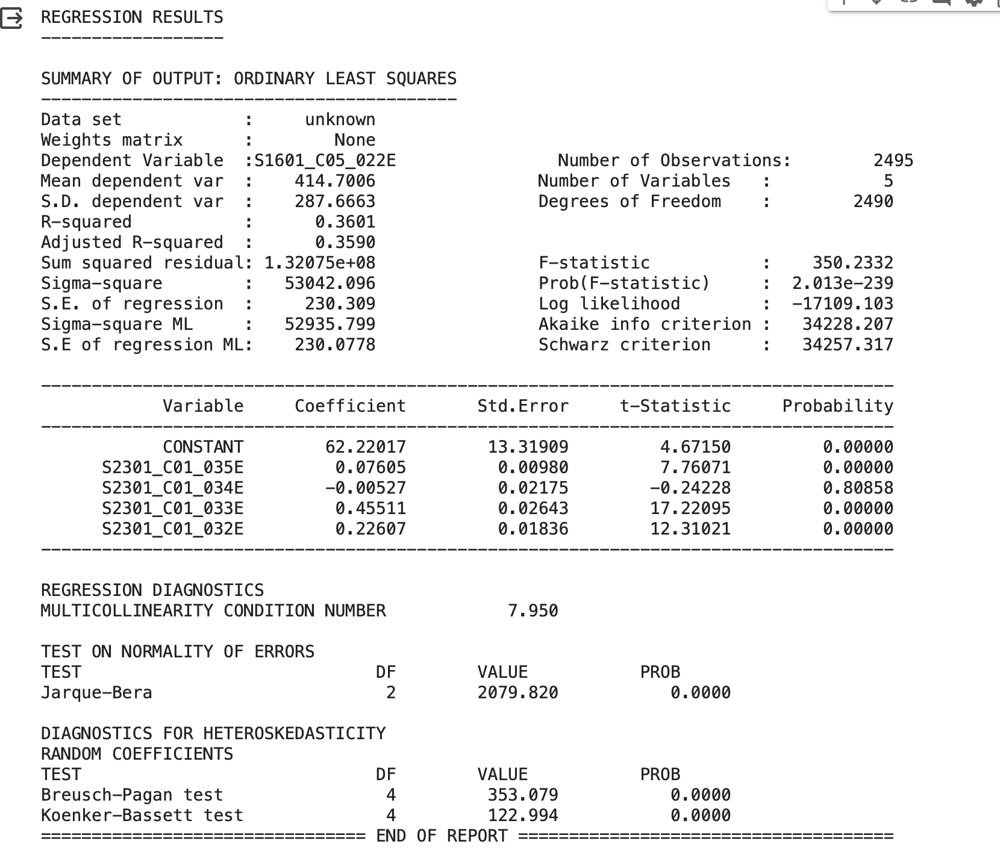
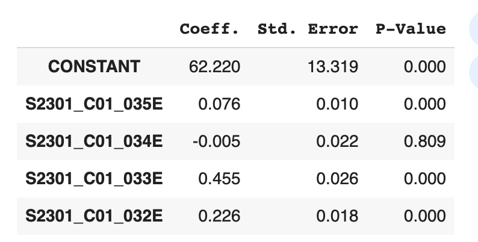
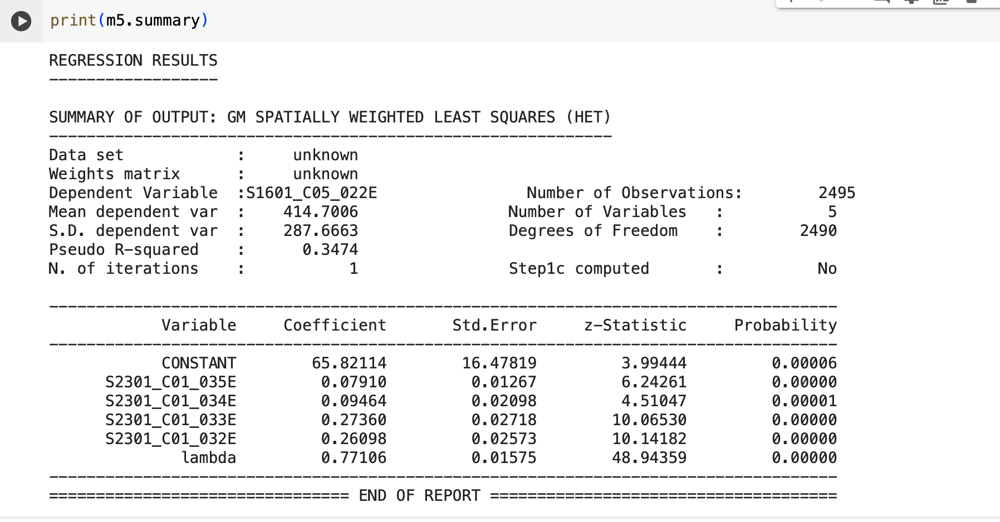
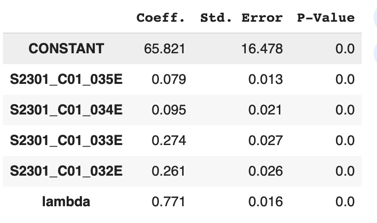

# Summary

### **Explore language-education-employement correlation**

Objective: Understanding the relationship between the language spoken(english limit), education attatinment, and employment.

---
# Method
**Develop OLS and Spatial Weight Regression** to investigate correlation among with non-english languages, educations levels, and employment rate.

- OLS is a global regression technique where a single set of model coefficients is estimated for the entire dataset.
- 
-  SWLS explicitly incorporates spatial dependencies into the modeling process by assigning weights to observations based on their spatial proximity. This allows SWLS to account for spatial autocorrelation and produce more accurate parameter estimates.
  
- --
# Result
### Educational attainment and Limted english speaker 
- Dependent variable is" Limited English speaker"
- - S1601_C05_022E: Speak English  less than very well"!!Percent of specified language speakers!!Population 5 years and over!!Speak a language other than English"
  
- Independent variables are "Educational attainment"  
- - S2301_C01_035E : Population 25 to 64 years!!Bachelor's degree or higher
- - S2301_C01_034E : Population 25 to 64 years!!Some college or associate's   degree
- - S2301_C01_033E :Population 25 to 64 years!!High school graduate (includes equivalency)
- - S2301_C01_032E :Population 25 to 64 years!!Less than high school graduate

##### OLS Model Interpretation 

The OLS model defines the correlation between the variables. In the OLS model, the R-square is 0.36, representing the English-limited speaker explains 36% of the educational attainment. 
It suggests a moderate relationship between the English-limited speaker and educational attainment.

 - The coefficient of 0.076(Bachelor's degree or higher) represents the estimated change in the predicted value of the limited English speaker for a one-unit change in the independent variable (Bachelor's degree or higher). 
This coefficient indicates a slightly positive relationship between limited English speakers and educational attainment.

-  The coefficient of -0.00527 (Some college or associate's degree) represents the estimated change in the predicted value of the limited English speaker for a one-unit change in the independent variable (Some college or associate's degree).  

     Since this coefficient is **Negative**, it indicates that as educational attainment(Some college or associate's degree) **decreases**, the likelihood of being a limited English speaker also **decreases**.

    Moreover, the p-value of education attainment (Some college or associate's degree) is larger than 0.05, which means there is a non-significant relationship between limited English speakers and educational attainment (Some college or associate's degrees).

- The coefficient of 0.455(High school graduate) represents the estimated change in the predicted value of the limited english speaker for a one-unit change in the independent variable (High school graduate). This is the highest coefficient, which is **the strongest relationship** between High school graduated and limited english speakers.

- The coefficient of 0.226(Less than high school graduate) represents the estimated change in the predicted value of the limited english speaker for a one-unit change in the independent variable (Less thanHigh school graduate). 

##### SWLS Model Interpretation 

A Pseudo R-squared value of 0.34 suggests that approximately 34% of the variability in the "Limited English Speaker" variable is explained by the variation in the "Educational Attainment" variables.
It represents a moderate relationship between limited english and education attainment.

- The lowest coeficient of (S2301_C01_035E) Bachelor's degree or higher is 0.079, which is **the weakest relationship** between English speaker level and education attatinment. 
  
- The highest coeficient of(S2301_C01_032E) Less than high school graduate is 0.261, which is **the strongest relationship** between English speaker level and education attatinment. 
  
- --
###### limitation: the output results are different between the SWLS model and the OLS model. It needs to optimize the data or method for validating the result.

In this report, I use SWLS and OLS models to investigate the relationship between education attainment and limited-English speakers.

Throughout those two models, they indicate that the predictor (education attainment) in the model is **moderately** successful in explaining the variance in the dependent variable(limited English speaker).

