# Summary

### **Explore language-education-employement correlation**

Objective: Understanding the relationship between the language spoken(english limit), education attatinment, and employment.

---
 # data source
<a href="https://data.census.gov/table/ACSST1Y2021.S2301?text=Table%20s2301&g=040XX00US53_050XX00US53057_010XX00US&tid=ACSST1Y2021.S2301"/>Employment Status (S2301) </a>

    
<a href="https://data.census.gov/table/ACSST1Y2022.S1601?text=Table%20s2301&g=040XX00US53_050XX00US53057_010XX00US"> Limited English Speking Household (S1601)</a>

---

# Method
**Develop OLS and Spatial Weight Regression** to investigate correlation among with non-english languages, educations levels, and employment rate.

- OLS is a global regression technique where a single set of model coefficients is estimated for the entire dataset.
- 
-  SWLS explicitly incorporates spatial dependencies into the modeling process by assigning weights to observations based on their spatial proximity. This allows SWLS to account for spatial autocorrelation and produce more accurate parameter estimates.
  
- --
# Result

### Speaking english very well and unemployment

- Dependent variable is" Limited English speaker"
- - **S2301_C04_021E**: Estimate!!Unemployment rate!!Population 20 to 64 years

- Independent variables are "speaking english very well"
  - **S1601_C03_006E** Estimate!!Speak English only or speak English very well"!!SPEAK A LANGUAGE OTHER THAN ENGLISH!!Spanish!!18 to 64 years old
  - **S1601_C03_010E** Estimate!!Speak English only or speak English very well"!!Percent of specified language speakers!!Population 5 years and over!!SPEAK A LANGUAGE OTHER THAN ENGLISH!!Other Indo-European languages"
  - **S1601_C03_014E**Estimate!!Speak English only or speak English very well"!!Asian and Pacific Island languages!!18 to 64 years old"
  - **S1601_C03_018E**Estimate!!Speak English only or speak English very well"!!SPEAK A LANGUAGE OTHER THAN ENGLISH!!Other languages!!18 to 64 years old"
  
  #### OLS model interpretation
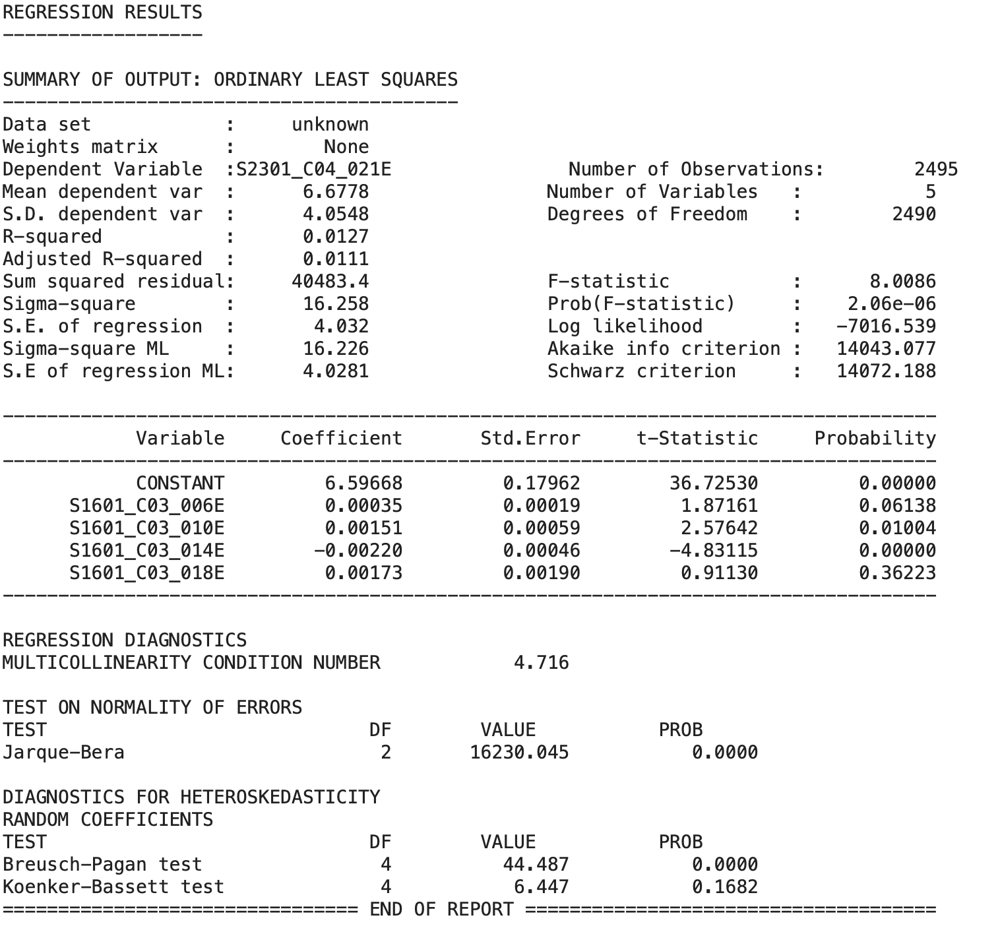

The OLS model describes the correlation between the variables. In the OLS model, the R-square is 0.0127, representing the unemployment explains 1.27% of the speaking English very well. 
It suggests a **weak relationship** between the English speaker and the unemployment rate.

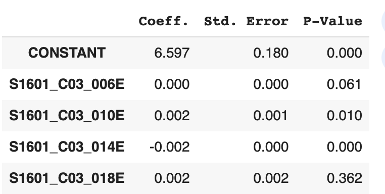

The p-values for speaking English very well and those who speak **Spanish** and **other languages** are larger than 0.05, which means there is a **non-significant** relationship between **well English speakers** and the **unemployment rate**.

The coefficient for speaking English very well who speaks **Asian and Pacific Island languages** is -.0002, which indicates that as speaking English very well who speaking Asian and Pacific Island languages **decreases**, the likelihood of an unemployment rate also **decreases**.

#### SWLS model interpretation
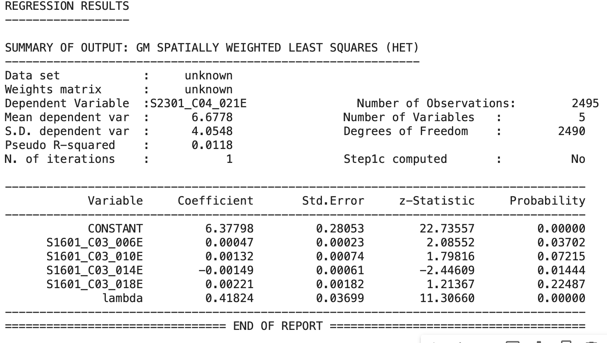

The swls model defines the correlation between the variables. In the SWLS model, the R-square is 0.0118, representing the unemployment explains 1.18% of the speaking english very well. 
It suggests a **weak** relationship between the well English speaker and unemployment rate.

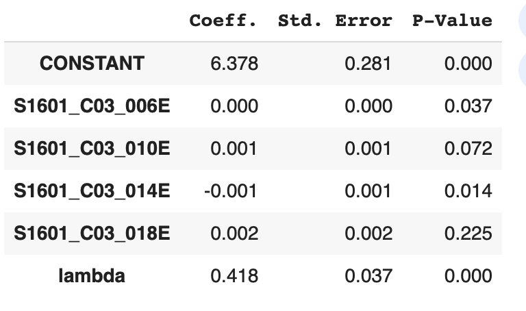

The p-values for speaking English very well and those who speak **Other Indo-European languages** and **other languages** are larger than 0.05, which means there is a **non-significant** relationship between **well English speakers** and the **unemployment rate**.

The coefficient for speaking English very well who speaks **Asian and Pacific Island languages** is -.0001, which indicates that as speaking English very well who speaking Asian and Pacific Island languages **decreases**, the likelihood of an unemployment rate also **decreases**.

### Speaking english less well and unemployment

- Dependent variable is" Limited English speaker"
- - **S2301_C04_021E**: Estimate!!Unemployment rate!!Population 20 to 64 years

- Independent variables are "speaking english less than very well"
  - **S1601_C05_006E**: Speak English  less than very well"!!SPEAK A LANGUAGE  OTHER THAN ENGLISH!!Spanish!!18 to 64 years old"
  - **S1601_C05_010E**: Speak English  less than very well"!!SPEAK A LANGUAGE OTHER THAN ENGLISH!!Other Indo-European languages!!18 to 64 years old"
  - **S1601_C05_014E**: Speak English  less than very well"!!SPEAK A LANGUAGE OTHER THAN ENGLISH!!Asian and Pacific Island languages!!18 to 64 years old"
  - **S1601_C05_018E**: Speak English  less than very well"!!SPEAK A LANGUAGE OTHER THAN ENGLISH!!**Other languages**!!18 to 64 years old"

#### OLS model interpretation

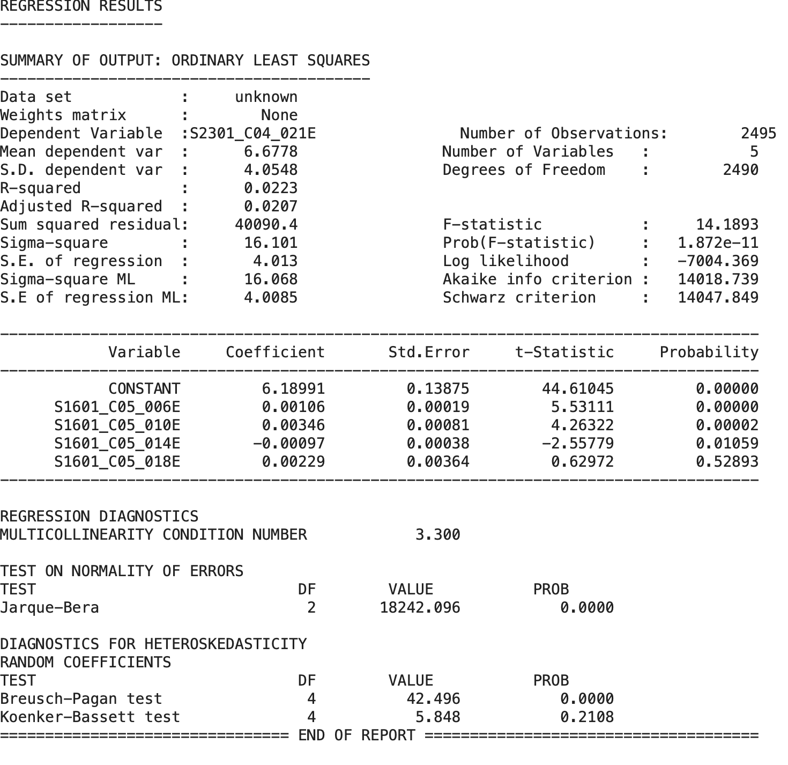

The OLS model defines the correlation between the variables. In the OLS model, the R-square is 0.0223, representing the unemployment explains 2.23% of the speaking English less well. 
It suggests a **weak relationship** between the limited English speaker and the unemployment rate.

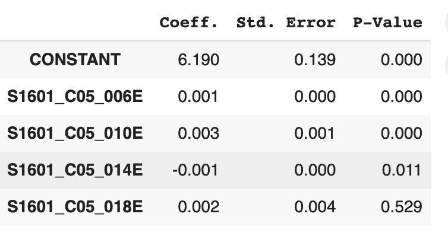

The p-values for speaking English very well and those who speak  **other languages** are larger than 0.05, meaning there is a **non-significant** relationship between **limited English speakers** and the **unemployment rate**.

The coefficient for speaking English less well who speaks **Asian and Pacific Island languages** is -.0001, which indicates that as speaking English less well who speaking Asian and Pacific Island languages **decreases**, the likelihood of an unemployment rate also **decreases**.

#### swls model interpretation
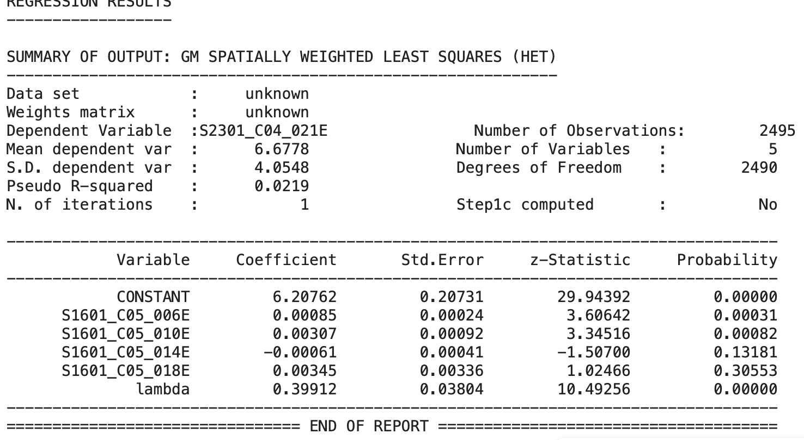

The SWLS model defines the correlation between the variables. In the SWLS model, the R-square is 0.0219, representing the unemployment explains 2.19% of the speaking english very well. 
It suggests a **weak** relationship between the well English speaker and unemployee rate.

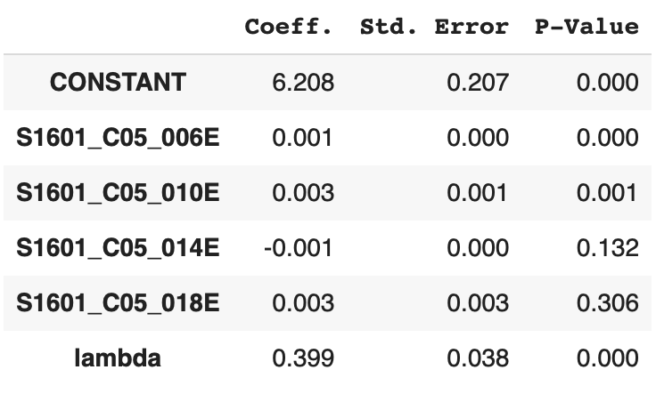

The p-values for speaking English very well and those who speak  **other languages** are larger than 0.05, meaning there is a **non-significant** relationship between **limited English speakers** and the **unemployment rate**.

The coefficient for speaking English less well who speaks **Asian and Pacific Island languages** is -.0001, which indicates that as speaking English less well who speaking Asian and Pacific Island languages **decreases**, the likelihood of an unemployment rate also **decreases**.

---
#### summary
Throughout the models, the unemploye rate has less explained the enlish speaking, meaning english speak level does not strongly asscosiate with unemployment rate.

- --

In this section, I decide to use english proficiency data and employment/ unemployment data to investigate correaltion.

### Limtied english and employment

- Dependent variable is" Limited English speaker"
- - **S2301_C03_021E**: Estimate!!employment rate!!Population 20 to 64 years

- Independent variables are "speaking english very well"
  - **S1601_C03_006E** Estimate!!Speak English only or speak English very well"!!SPEAK A LANGUAGE OTHER THAN ENGLISH!!Spanish!!18 to 64 years old
  - **S1601_C03_010E** Estimate!!Speak English only or speak English very well"!!Percent of specified language speakers!!Population 5 years and over!!SPEAK A LANGUAGE OTHER THAN ENGLISH!!Other Indo-European languages"
  - **S1601_C03_014E**Estimate!!Speak English only or speak English very well"!!Asian and Pacific Island languages!!18 to 64 years old"
  - **S1601_C03_018E**Estimate!!Speak English only or speak English very well"!!SPEAK A LANGUAGE OTHER THAN ENGLISH!!Other languages!!18 to 64 years old"

#### OLS model interpretation

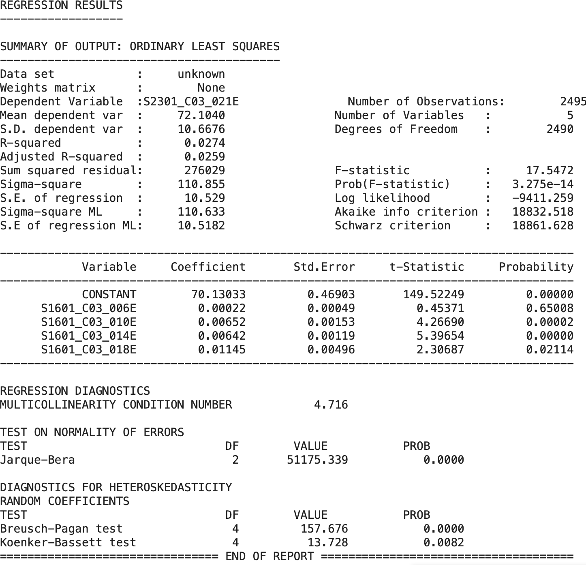

The OLS model defines the correlation between the variables. In the OLS model, the R-square is 0.0259, representing the employment explains 2.59% of the speaking English less well. 
It suggests a **weak relationship** between the limited English speaker and the employment rate.

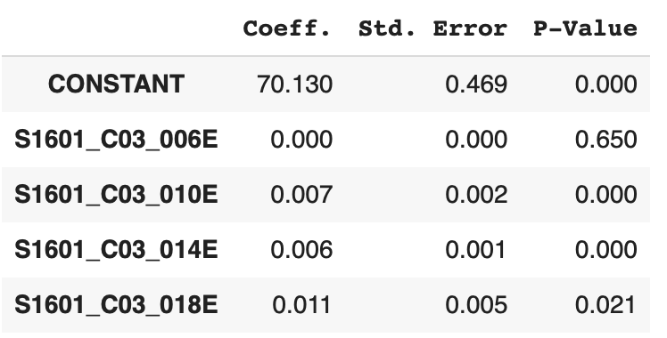

The p-values for speaking English very well and those who speak  **Spanish** are larger than 0.05, meaning there is a **non-significant** relationship between **limited English speakers** and the **employment rate**.

### Speaking english well and employment

- Dependent variable is" Limited English speaker"
- - **S2301_C03_021E**: Estimate!!employment rate!!Population 20 to 64 years

- Independent variables are "speaking english less than very well"
  - **S1601_C05_006E**: Speak English  less than very well"!!SPEAK A LANGUAGE  OTHER THAN ENGLISH!!Spanish!!18 to 64 years old"
  - **S1601_C05_010E**: Speak English  less than very well"!!SPEAK A LANGUAGE OTHER THAN ENGLISH!!Other Indo-European languages!!18 to 64 years old"
  - **S1601_C05_014E**: Speak English  less than very well"!!SPEAK A LANGUAGE OTHER THAN ENGLISH!!Asian and Pacific Island languages!!18 to 64 years old"
  - **S1601_C05_018E**: Speak English  less than very well"!!SPEAK A LANGUAGE OTHER THAN ENGLISH!!**Other languages**!!18 to 64 years old"

  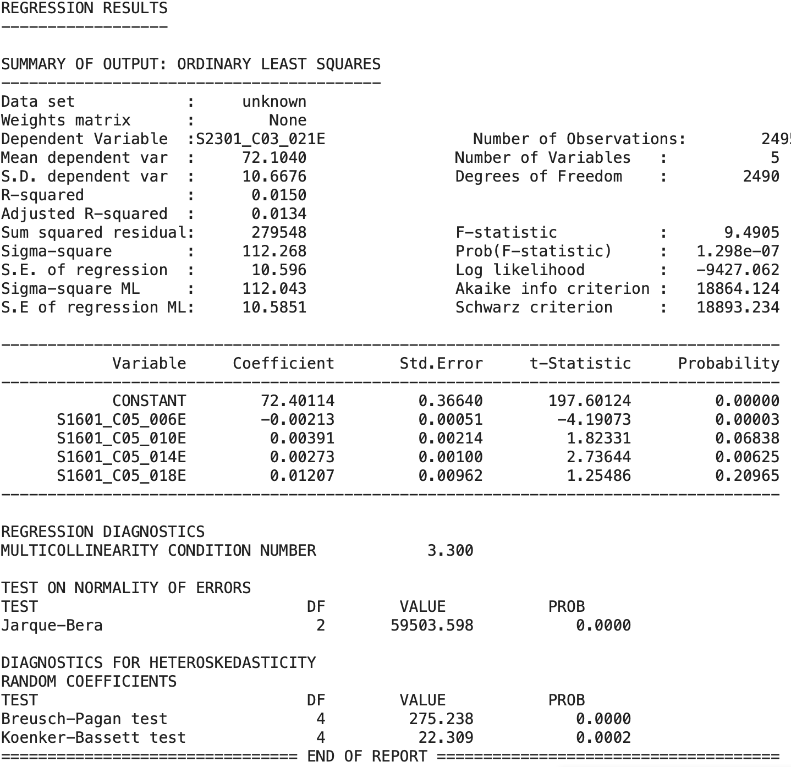

  The OLS model defines the correlation between the variables. In the OLS model, the R-square is 0.0134, representing the employment explains 1.34% of the speaking English well. 
  
  It suggests a **weak relationship** between the well English speaker and the employment rate.

  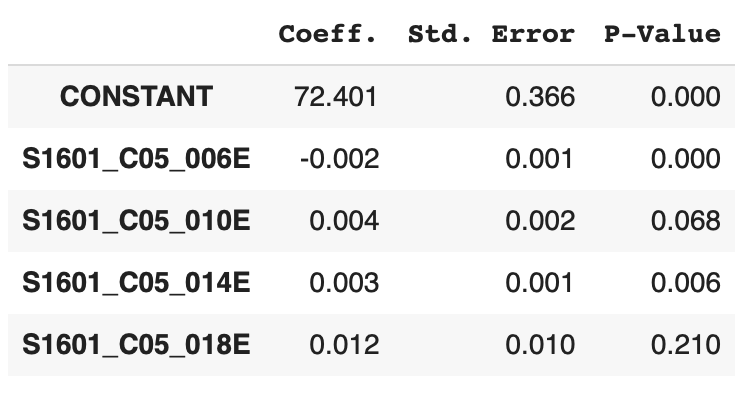
  
  The coefficient for speaking English very well who speaks **Spanish** is -.002, which indicates that as speaking English very well who speaking Spanish **decreases**, the likelihood of an employment rate also **decreases**.

  The p-values for speaking English very well and those who speak  **Other Indo-European languages** are larger than 0.05, meaning there is a **non-significant** relationship between **limited English speakers** and the **employment rate**.

---
# hint 
- Overall, English efficiency (Proficient English speakers or limited English speakers) rarely explains the employment rate and unemployment rate.
  
- whether proficient or limited English speakers who speak the Asian language do not have a high association with the unemployment rate and employment rate, it can suggest English efficiency does not have a huge influence on the employment situation in the Asian community.
  - As we can see Speaking English less well and the unemployment model, Limited English proficiency is inversely proportional to the unemployment rate.
