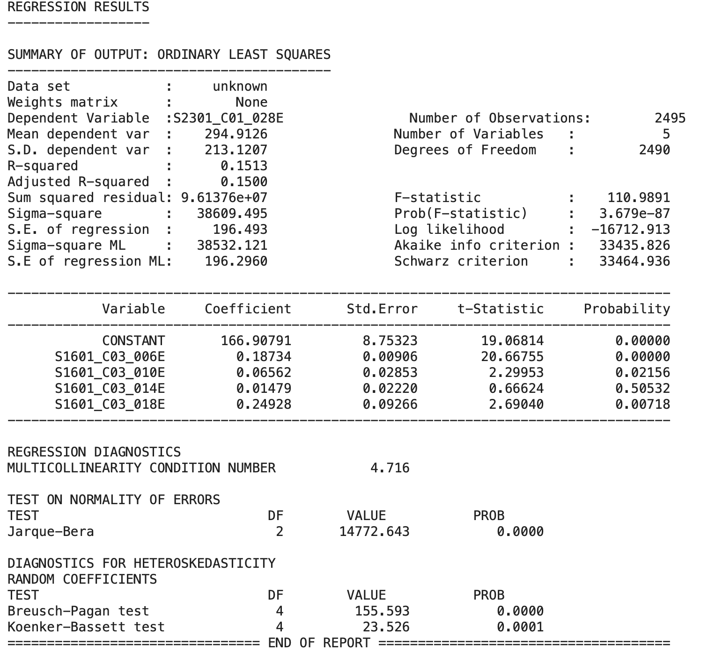

# Excusive Summary

### **Explore language-education-employement correlation**

Objective: Understanding the relationship between the language spoken(english limit), education attatinment, poverty and employment.

---
# Method
**Develop OLS and Spatial Weight Regression** to investigate correlation among with non-english languages, educations levels, povety, and employment rate.

- OLS is a global regression technique where a single set of model coefficients is estimated for the entire dataset.
-  SWLS explicitly incorporates spatial dependencies into the modeling process by assigning weights to observations based on their spatial proximity. This allows SWLS to account for spatial autocorrelation and produce more accurate parameter estimates.
  
- --
# Result interpretation
### Poverty and English speaker level

#### speaking english less than very well
- Dependent variable is 'below the poverty level' 
  - **2301_C01_028E**: Population 20 to 64 years!!POVERTY STATUS IN THE PAST 12 MONTHS!!Below poverty level

- Independent variables are "speaking english less than very well"
  - **S1601_C05_006E**: Speak English  less than very well"!!SPEAK A LANGUAGE  OTHER THAN ENGLISH!!Spanish!!18 to 64 years old"
  - **S1601_C05_010E**: Speak English  less than very well"!!SPEAK A LANGUAGE OTHER THAN ENGLISH!!Other Indo-European languages!!18 to 64 years old"
  - **S1601_C05_014E**: Speak English  less than very well"!!SPEAK A LANGUAGE OTHER THAN ENGLISH!!Asian and Pacific Island languages!!18 to 64 years old"
  - **S1601_C05_018E**: Speak English  less than very well"!!SPEAK A LANGUAGE OTHER THAN ENGLISH!!**Other languages**!!18 to 64 years old"

##### OLS Model Interpretation 

The OLS model defines the correlation between the variables. In the OLS model, the R-square is 0.3087, representing the poverty status explains 30.87% of the limited English speakers.
It suggests a moderate relationship between poverty status and limited English speaker.

###### Quick summary

- The highest coeficient of Other languages who speak English less than very well is 0.942, which is **the strongest relationship** between Poverty and English speaker level. 
  
  The coefficient of 0.942 represents the estimated change in the dependent variable (below poverty level) associated with a one-unit increase in the independent variable (proportion of people who speak other languages and have limited English proficiency), holding all other variables constant.

- The lowest coeficient of Asian and Pacific Island languages who speak English less than very well is 0.109, which is **the weakest relationship** between Poverty and English speaker level.
   The coefficient of 0.109 represents the estimated change in the dependent variable (below poverty level) associated with a one-unit increase in the independent variable (proportion of people who speak Asian and Pacific Island languages and have limited English proficiency), holding all other variables constant.

---
##### SWLS Model Interpretation 

A Pseudo R-squared value of 0.3035 suggests that approximately 30.35% of the variability in the dependent variable("Below poverty level") is explained by the variation in the independent variables (Limited English Speaker).
It suggests a moderate relationship between poverty status and limited English speakers.

###### Quick summary

- The highest coeficient of Other languages who speak english less than very well is 0.832, which is **the strongest relationship** between Poverty and English speaker level. 
    The coefficient of 0.832 represents the estimated change in the dependent variable (below poverty level) associated with a one-unit increase in the independent variable (proportion of people who speak other languages and have limited English proficiency), holding all other variables constant.

- The lowest coeficient of Asian and Pacific Island languages who speak english less than very well is 0.109, which is **the weakest relationship** between Poverty and English speaker level. 
  The coefficient of 0.109 represents the estimated change in the dependent variable (below poverty level) associated with a one-unit increase in the independent variable (proportion of people who speak Asian and Pacific Island languages and have limited English proficiency), holding all other variables constant.

  -------

  #### Speaking english very well
- Dependent variable is 'below the poverty level' 
  - **2301_C01_028E**: Population 20 to 64 years!!POVERTY STATUS IN THE PAST 12 MONTHS!!Below poverty level

- Independent variables are "speaking english very well"
  - **S1601_C03_006E** Estimate!!Speak English only or speak English very well"!!SPEAK A LANGUAGE OTHER THAN ENGLISH!!Spanish!!18 to 64 years old
  - **S1601_C03_010E** Estimate!!Speak English only or speak English very well"!!Percent of specified language speakers!!Population 5 years and over!!SPEAK A LANGUAGE OTHER THAN ENGLISH!!Other Indo-European languages"
  - **S1601_C03_014E**Estimate!!Speak English only or speak English very well"!!Asian and Pacific Island languages!!18 to 64 years old"
  - **S1601_C03_018E**Estimate!!Speak English only or speak English very well"!!SPEAK A LANGUAGE OTHER THAN ENGLISH!!Other languages!!18 to 64 years old"
  
##### OLS Model Interpretation 

The OLS model defines the correlation between the variables. In the OLS model, the R-square is 0.1513, representing the poverty status explains 15.13% of the limited English speakers. 
It implies a weak relationship between poverty and speaking English very well.

###### Quick summary

- The lowest coefficient (Asian and Pacific Island languages who speak English very well) is 0.015, which is **the weakest relationship** between Poverty and English speaker level.
  
  Additionally, the p-value (Asian and Pacific Island languages who speak English very well)  is larger than 0.05, which means there is a non-significant relationship between Poverty and English speaker level.

- The highest coefficient (For other languages who speak English very well) is 0.249, which is **the strongest relationship** between Poverty and English speaker level.  
  
  The coefficient of 0.942 represents the estimated change in the dependent variable (below poverty level) associated with a one-unit increase in the independent variable (proportion of people who speak other languages and have limited English proficiency), holding all other variables constant.

-  The p-value of the other language that speaks English very well is larger than 0.05, which means there is a non-significant relationship between Poverty and English speaker level.

##### SWLS Model Interpretation 

A Pseudo R-squared value of 0.3035 suggests that approximately 30.35% of the variability in the dependent variable("Below poverty level") is explained by the variation in the independent variables (well English Speaker). 

It indicates that the predictor (well English speaker) in the model is **moderately** successful in explaining the variance in the dependent variable(Below the poverty level).

- The lowest coeficient of Asian and Pacific Island languages who speak english  very well is 0.0107, which is **the weakest relationship** between Poverty and English speaker level.

- The highest coeficient of Other languages who speak english very well is 0.249, which is **the strongest relationship** between Poverty and English speaker level. The coefficient of 0.942 represents the estimated change in the dependent variable (below poverty level) associated with a one-unit increase in the independent variable (proportion of people who speak other languages and have limited English proficiency), holding all other variables constant

---
# conclusion

Overall, comparing speaking well and speaking English less well, speaking English less well has **more explained** the below poverty level **than** very well, since R-square of **speaking English less than very well** larger than **speaking English speak very well**.

