# Limited English Households Analysis

**Excustive summary**
Investigate and compare the regional differences in the prevalence of non-English speaking households by various ethnic across SPA regions.
- In the context of the ANOVA analysis, it suggested that there are significant differences in the distribution of **all** different language households in different service planning areas (SPAs). 

In the ANOVA analysis, observering an F-number greater than 1, indicating significant differences between the different groups

In order to deeply study the pattern of spatial distribution, then using Moran's I to evaluate the spatial autocorrelation and distribution pattern between different regions. 

- Using moran's I to explore the spatial patterns of relationships or clustering tendencies among different languages speaking households.

This helps to reveal whether household distributions tend to be spatially clustered or dispersed, providing a more comprehensive geographical explanation.

## Method

- **ANOVA**
ANOVA (Analysis of Variance) is a statistical test used to compare the means of more groups to determine whether there are statistically significant differences between these group means. In the context of regions, ANOVA aims to determine significant differences in a Variables(language speaking households) among regions(SPAs). Thus, this project utilizes ANOVA analysis to invetigate and compare the SPAs regional differences variation of languages speaking households.

- **Moran's I**
  Moran's I is a statiscal measure used to assess spatial autocorrelation, which aims to identify whether value are clustered or dispersed across area. This project operates Moran's I to involves comparing the observed spatial arrangement of Limited English Households with what would be expected under spatial randomness.

Explore language-education-employement correlation
Objective: Understanding the relationship between the language spoken(english limit), education attatinment, and employment.
Approach: Develop OLS and Spatial Weight Regression to investigate correlation among with non-english languages, educations levels, and employment rate

## Data source

- <a href="https://data.census.gov/table/ACSST1Y2022.S1602?text=Table%20s2301&g=040XX00US53_050XX00US53057_010XX00US"> Limited English Speking Household (S1602)</a>

- 

# Result plot and interpretation

## All limited English-speaking households

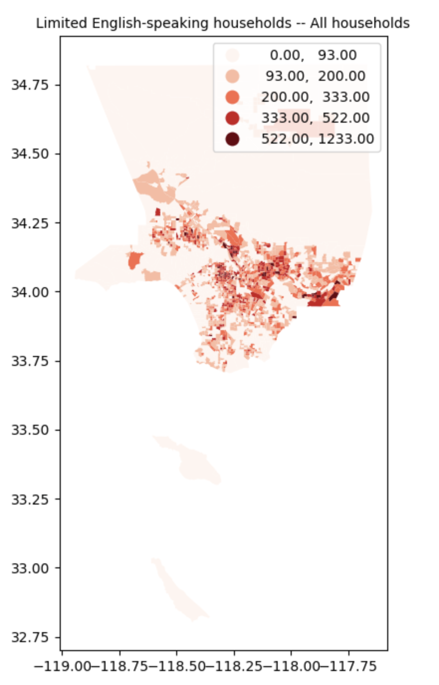

### ANOVA

 

**ANOVA interpretation**

Null hypothesis: Each SPA region have no significant difference(equal) households of limited english speaking.

The p-value is smaller than the significant level, thus we can reject the null hypothesis. The Limited English-speaking households are **significantly different** among SPA regions.

The F ratio is higher than 1.0, so the variation among group means is more than you'd expect to see by chance, and the null hypothesis is false, which means the Limited English-speaking households have **a large difference** among SPA regions.

### Moran's I
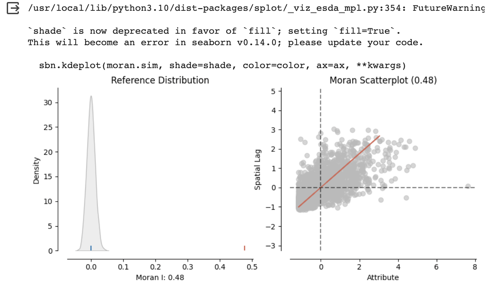

**interpretation**
A Moran's I value of 0.48 indicates a moderate positive spatial autocorrelation in the variables. The Moran scatterplot shows that the Low-Low value tends to cluster together.

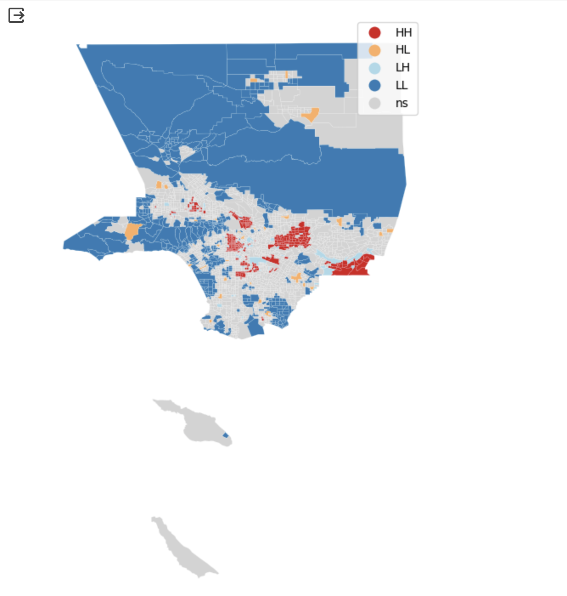

The hotspot area is located in the DTLA and San Gabriel area where limited English Households in this area and its surroundings are larger than average.

The coldspot area is located in the Northern and West LA area, signifying concentrated areas with lower levels of limited English households surrounded by similarly low prevalence in their vicinity.

## Spanish Households

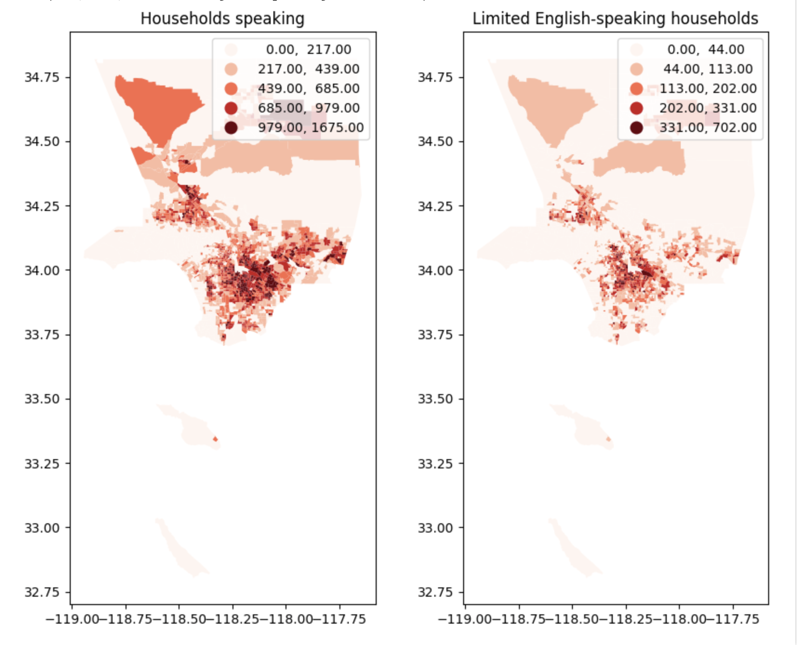

### ANOVA

**ANOVA interpretation**
Null hypothesis: no significant difference in the average number of limited English speaking households and spanish speaking household across the different SPA regions

Both of the p-values are **smaller** than the significant level, thus we can reject the null hypothesis. Spanish-speaking households and the Limited English-speaking Spanish households are **largely different** among SPA regions.

Both of the F ratios are higher than 1.0, so the variation among group means is more than you'd expect to see by chance, and the null hypothesis is false, which means **stronger variation** among the SPA region.

### Moran's I
#### **All households!!Households speaking -- Spanish**
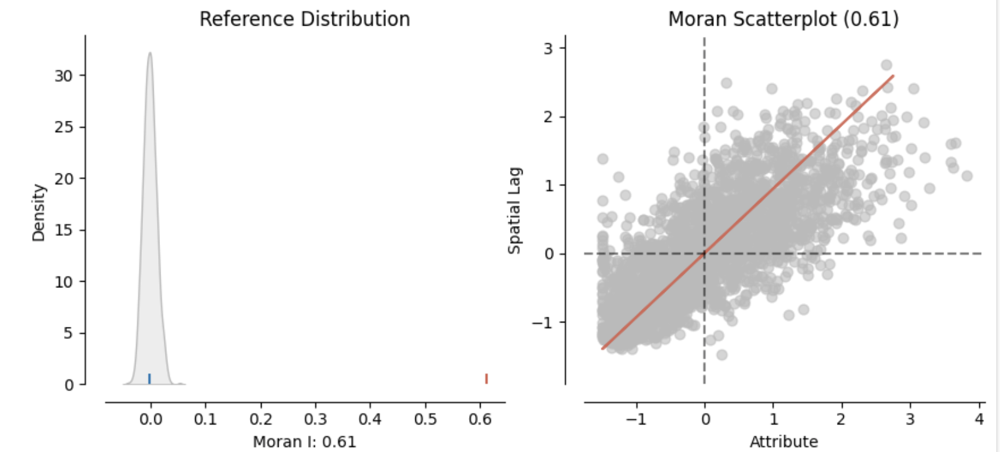

A Moran's I value of 0.61 indicates a moderate positive spatial autocorrelation in the variables. The value tends to be clustered together and does **not** have largely spatial randomness.

Cluster: The hotspot area is located in South LA, which represents areas where Spanish-speaking households in this area and its surroundings are more than average.  
The Coldspot area is located in the west LA and San Gabriel Valley area, and it represents significant clusters of less Spanish-speaking household values surrounded by less Spanish-speaking households.

Outliers: The High-low area is located around the Northbridge area and its surroundings in cold spots, which the map result displays larger Spanish-speaking households and its surroundings have fewer Spanish-speaking households.

#### **limited English households Spanish**

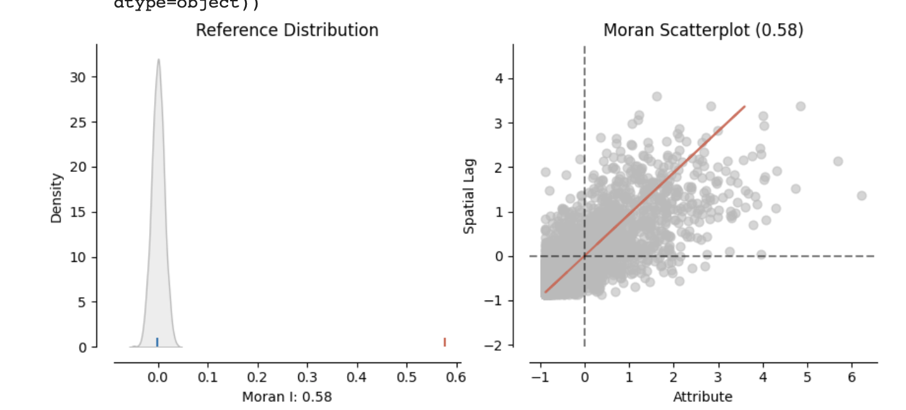

interpretation:
A Moran's I value of 0.58 indicates a positive spatial autocorrelation in the variables， which means not completely spatial randomness, having moderate spatial autocorrelation.

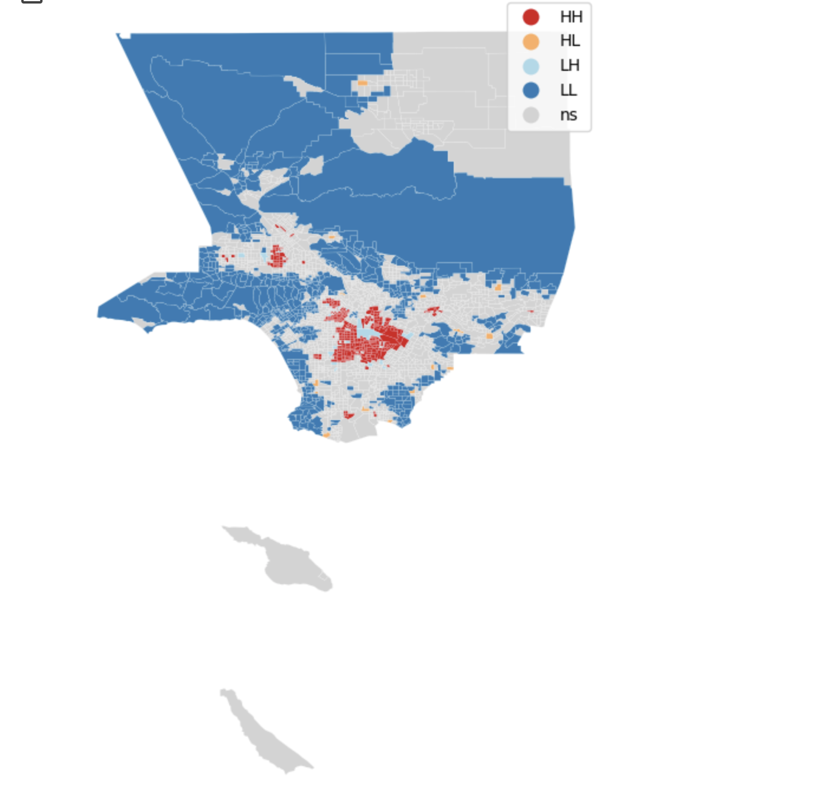

Cluster: 
The hotspot area is located in South LA, which represents areas where Limited-English speaking households in this area and its surroundings are larger than average. 

The Coldspot area is located in the west LA and San Gabriel Valley area, and it represents significant clusters of less Limited-English speaking household values surrounded by less Limited-English speaking household values.

## Other Indo-European languages

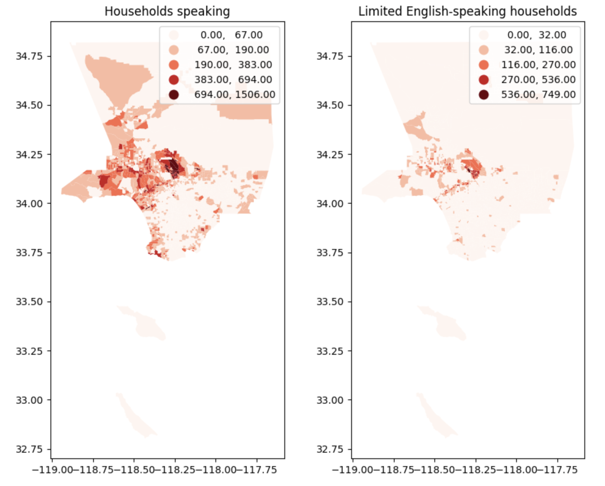

### ANOVA
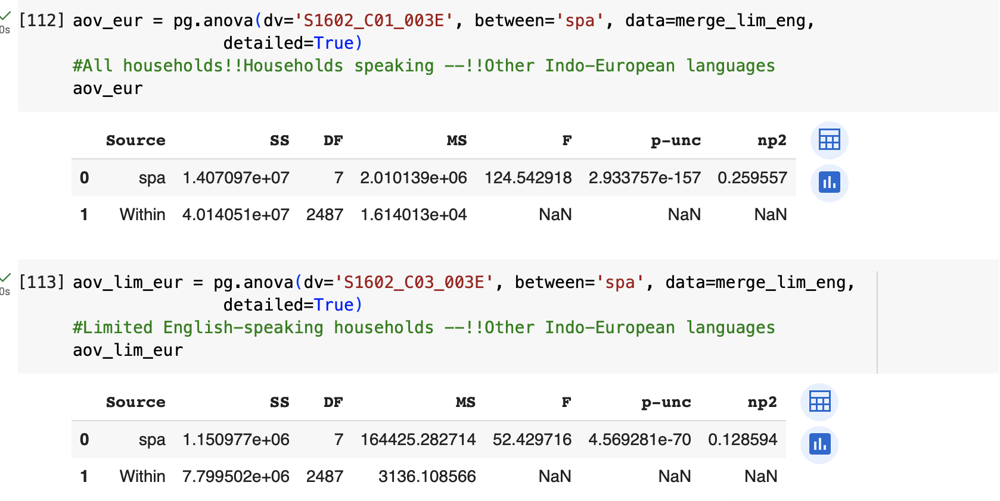

Both p-values are **less** than significant levels, thus we can reject the null hypothesis. The Other Indo-European language-speaking households and Limited English of the other indo-European speaking households are **significantly different** between SPA regions

The F ratio is higher than 1.0, so the variation among group means is more than you'd expect to see by chance, and the null hypothesis is false, which means **a large difference** among SPA regions.

###  Moran's I
**All households!!Households speaking --Other Indo-European languages**

A Moran's I value of 0.68 indicates a positive spatial autocorrelation in the variables， which means not completely spatial randomness, having relatively high spatial autocorrelation, and values tend to cluster together.

Cluster: 
The hotspot area focuses on South LA, which represents areas where Other Indo-European-speaking households in this area and its surroundings are larger than average. 

The Coldspot area concentrates in the west LA and San Gabriel Valley area, and it represents significant clusters of less Spanish-speaking household values surrounded by fewer Spanish-speaking household values.

**All households!!Limited English Households --Other Indo-European languages**

A Moran's I value of 0.58 indicates a positive spatial autocorrelation in the variables, which means not completely spatial randomness, having relatively high spatial autocorrelation, and values tend to cluster together.

Cluster: 
The hotspot area is located in South LA, which represents areas where Limited-English households in this area and its surroundings are more than average. 

The Coldspot area is located in the west LA and San Gabriel Valley area, and it represents significant clusters of less Limited-English speaking household values surrounded by less Limited-English household values.

## Asian and Pacific Island languages

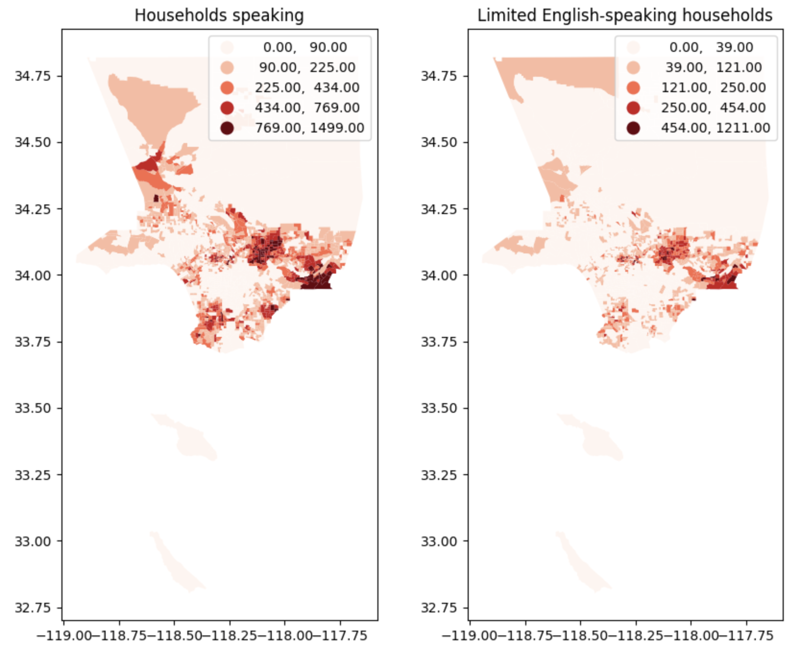

### Anova

Both p-values are less than significant levels, thus we can reject the null hypothesis. The Asian-speaking households and Limited English of Asian-speaking households are **significantly different** between SPA regions

The F ratio is higher than 1.0, so the variation among group means is more than you'd expect to see by chance, and the null hypothesis is false, which means **a large difference** among SPA regions.

The Asian-speaking households have the **highest F value** within the overall analysis, which means the **strongest variation** among the SPA in general.

### Moran's I
**All households!!Households speaking -- Asian and Pacific Island languages**

A Moran's I value of 0.67 indicates a positive spatial autocorrelation in the variables, which means not completely spatial randomness, having relatively strong spatial autocorrelation, and values trend to cluster together.

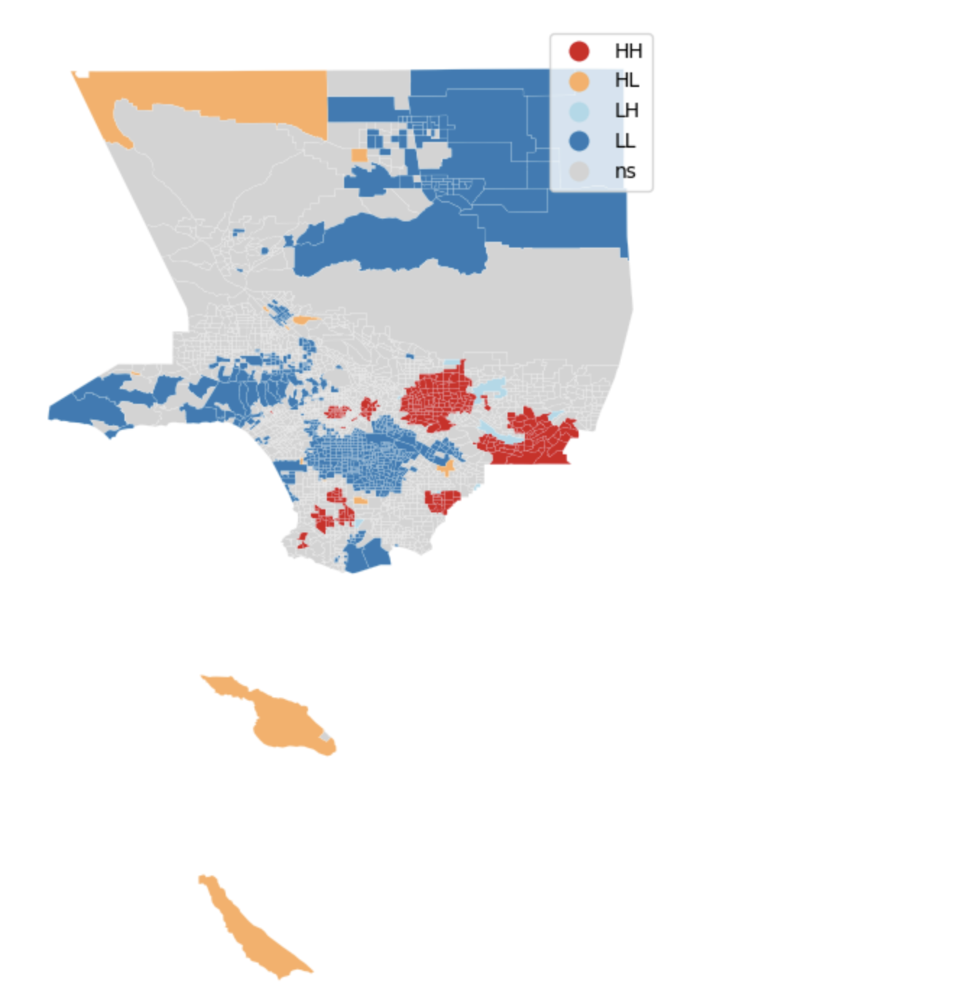

Cluster: 
The hotspot area is located in San Gabriel Valley area, which represents areas where Asian-speaking and Pacific-Island-speaking households in this area and its surroundings are more than average. 

The Coldspot area is located in the DTLA area, and it represents significant clusters of less Asian-speaking and Pacific-Island-speaking households surrounded by less SAsian-speaking and Pacific-Island-speaking households.

**All households!!Limited English Households -- Asian and Pacific Island languages**

A Moran's I value of 0.57 indicates a positive spatial autocorrelation in the variables, which means not completely spatial randomness, having relative spatial autocorrelation, and values tend to cluster together.

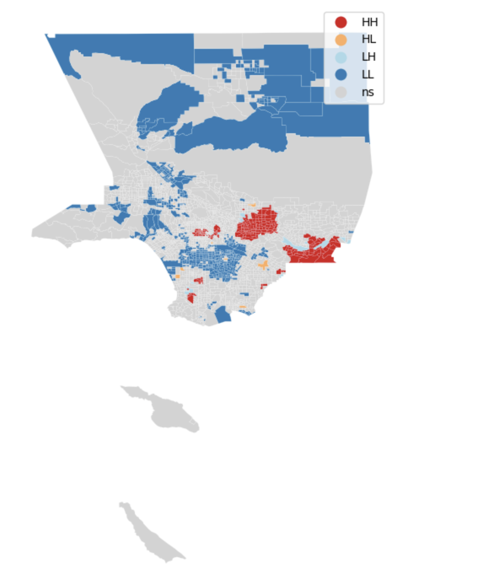

Cluster: 
The hotspot area is located in San Gabriel Valley area, which represents areas where Limited-English speaking households in this area and its surroundings are more than average. 

The Coldspot area is located in the DTLA area, and it represents significant clusters of less Limited-English households surrounded by less Limited-English speaking households.

## Other languages
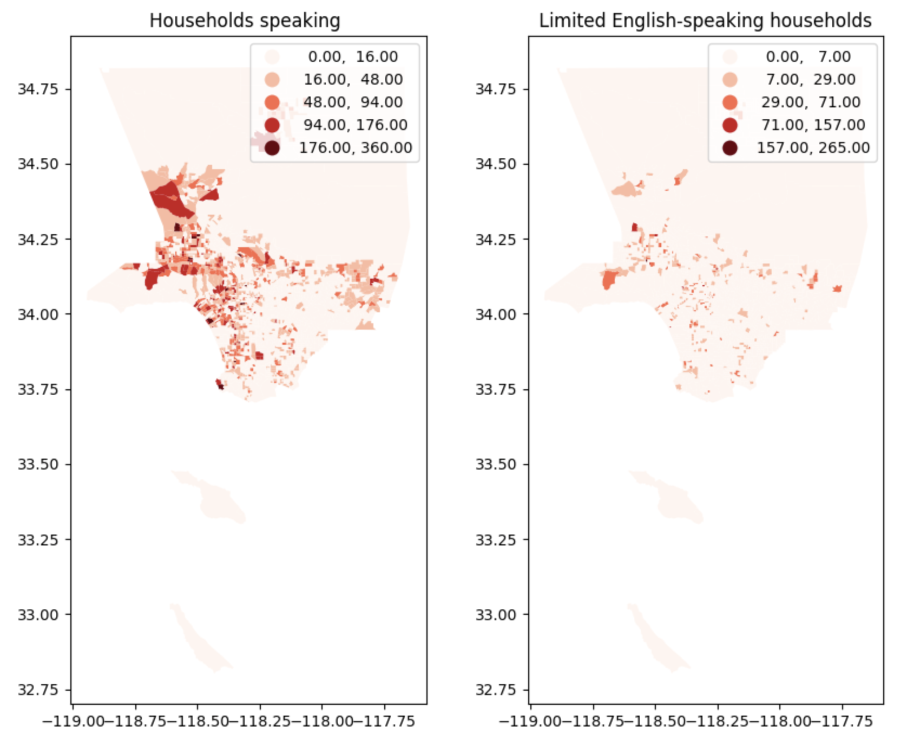

### Anova

Both p-values are less than significant levels, thus we can reject the null hypothesis. The Other language-speaking households and Limited English of Other language-speaking households are **significantly different** between SPA regions.

Both of the F ratio is higher than 1.0, so the variation among group means is more than you'd expect to see by chance, and the null hypothesis is false, which means **a large difference** among SPA regions.

The Other language-speaking households have the smallest F value within the overall analysis, which means the weakest variation among the SPAs in general.

### Moran's I
- **All households!!Households speaking -- Other languages**

 A value close to 0 indicates a lack of spatial autocorrelation.  A Moran's I value of 0.29 indicates less spatial autocorrelation in the variables,  which means generally spatial randomness, having relatively low spatial autocorrelation.

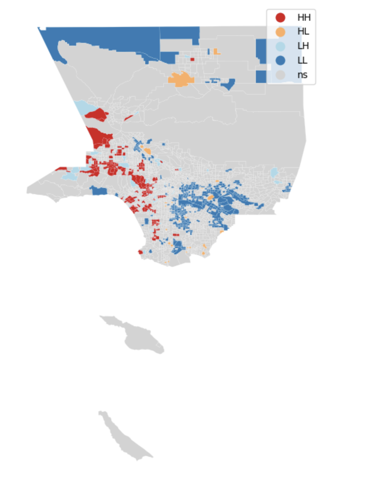

This map displays less spatial pattern in other language-speaking households, and they lessly cluster in west LA and southeast LA.

- **All households!!Limited English Households -- Other languages**

 A value close to 0 indicates a lack of spatial autocorrelation.  A Moran's I value of 0.07 indicates less positive spatial autocorrelation in the variables， which means generally spatial randomness, having less spatial autocorrelation.

The coldspots are generally randomly distributed in LA county, hard to identify spatial patterns.

# Future studies
In the future studies, I would use the regression model to investigate the specific relationship between limited English proficiency, and educational attainment, income within the context of Los Angeles County.

You can see the regression result in the colad, but I need to find more data to optimize the research project.

